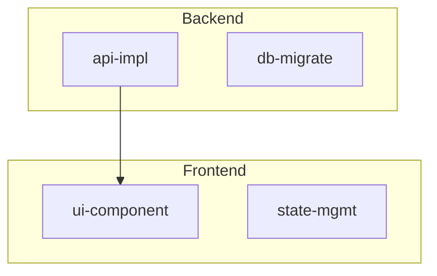
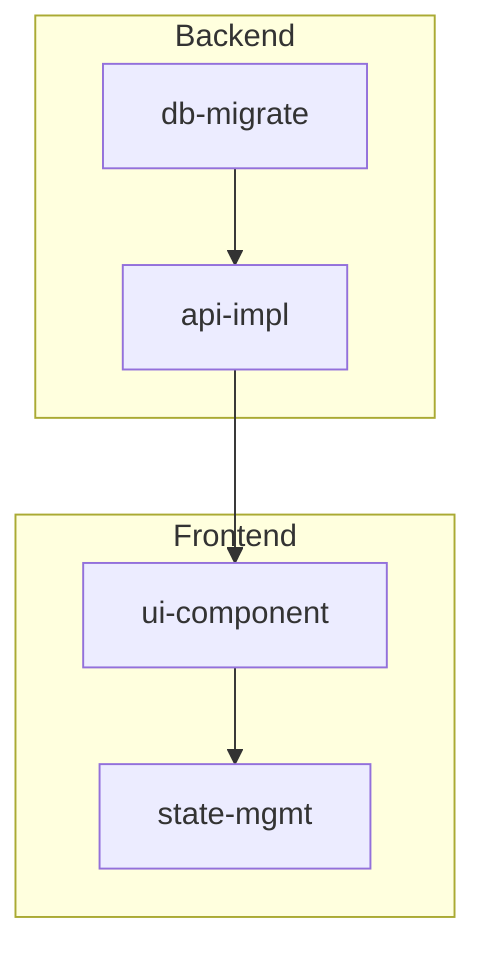

# Issue #24: タスクグループ / 階層化 - グラフ拡張設計

## 調査概要

Issue #24のタスクグループ/階層化機能に関して、グラフ出力の拡張に必要な既存実装を調査しました。

**調査日**: 2026-01-21
**関連Issue**: #24

---

## 1. print_mermaid_graph() 関数

**ファイル**: `src/main.rs:2112-2122`

### 現在の実装

```rust
fn print_mermaid_graph(plan: &Plan) {
    println!("graph TD");
    for task in &plan.tasks {
        if task.deps.is_empty() {
            println!("  {};", task.id);
        }
        for dep in &task.deps {
            println!("  {} --> {};", dep, task.id);
        }
    }
}
```

### 分析

- シンプルな有向グラフ (`graph TD`) を出力
- 依存関係のないタスクは単独ノードとして出力
- タスク間の依存関係を `dep --> task` 形式で出力
- **グループ情報は未対応**

---

## 2. Mermaid subgraph 対応設計

### Mermaid subgraph 構文



### 拡張設計案

```rust
fn print_mermaid_graph(plan: &Plan) {
    println!("graph TD");

    // グループごとにタスクを収集
    let mut grouped: HashMap<Option<String>, Vec<&Task>> = HashMap::new();
    for task in &plan.tasks {
        grouped.entry(task.group.clone()).or_default().push(task);
    }

    // グループ化されたタスクを subgraph で囲む
    for (group, tasks) in &grouped {
        if let Some(group_name) = group {
            println!("    subgraph {} [{}]", sanitize_id(group_name), group_name);
            for task in tasks {
                println!("        {}", task.id);
            }
            println!("    end");
        } else {
            // グループなしのタスクはトップレベル
            for task in tasks {
                if task.deps.is_empty() {
                    println!("    {};", task.id);
                }
            }
        }
    }

    // 依存関係を出力（グループを跨ぐ関係も含む）
    for task in &plan.tasks {
        for dep in &task.deps {
            println!("    {} --> {};", dep, task.id);
        }
    }
}
```

### 出力例



---

## 3. print_ascii_graph() 関数

**ファイル**: `src/main.rs`
**行番号**: 2124-2133

### 現在の実装

```rust
fn print_ascii_graph(plan: &Plan) {
    for task in &plan.tasks {
        if task.deps.is_empty() {
            println!("{}", task.id);
        }
        for dep in &task.deps {
            println!("{} -> {}", dep, task.id);
        }
    }
}
```

### グループ区切り線の拡張設計

```rust
fn print_ascii_graph(plan: &Plan) {
    // グループごとにタスクを収集
    let mut grouped: BTreeMap<Option<String>, Vec<&Task>> = BTreeMap::new();
    for task in &plan.tasks {
        grouped.entry(task.group.clone()).or_default().push(task);
    }

    let mut first = true;
    for (group, tasks) in &grouped {
        if !first {
            println!();
        }
        first = false;

        // グループヘッダー
        if let Some(group_name) = group {
            println!("=== {} ===", group_name);
        } else {
            println!("=== (ungrouped) ===");
        }

        // タスクと依存関係
        for task in tasks {
            if task.deps.is_empty() {
                println!("  {}", task.id);
            }
            for dep in &task.deps {
                println!("  {} -> {}", dep, task.id);
            }
        }
    }
}
```

### 出力例

```
=== Backend ===
  db-migrate
  db-migrate -> api-impl

=== Frontend ===
  api-impl -> ui-component
  ui-component -> state-mgmt

=== (ungrouped) ===
  setup
```

---

## 4. dry-run 出力でのグループ情報表示

### 関連コード

| 関数 | ファイル | 行番号 | 機能 |
|------|----------|--------|------|
| `handle_dry_run()` | src/main.rs | 197-274 | 基本的なdry-run出力 |
| `handle_dry_run_extended()` | src/main.rs | 277-400 | 拡張版（Wave表示、ロック検出、Mermaid出力） |
| `generate_execution_waves()` | src/dry_run.rs | 32-130 | 実行波の生成ロジック |

### 現在の出力形式

```
Dry run mode - no tasks will be executed

Plan: example-plan
Tasks: 5

Execution order:
  1. task-a (deps: none) [codex]
  2. task-b (deps: task-a) [claude_code]
```

### グループ情報追加の拡張設計

```
Dry run mode - no tasks will be executed

Plan: example-plan
Tasks: 5
Groups: 2

Execution order:
  1. [Backend] task-a (deps: none) [codex]
  2. [Backend] task-b (deps: task-a) [claude_code]
  3. [Frontend] task-c (deps: task-b) [codex]
```

または Wave 表示の場合:

```
Execution order (max_concurrency=4):
  Wave 1:
    [Backend] task-a (parallel)
    [Backend] task-b (parallel)
  Wave 2:
    [Frontend] task-c (depends on task-a, task-b)
```

---

## 5. quedex graph コマンドへの --group オプション追加

### 現在のCLI定義

**ファイル**: `src/cli.rs`
**行番号**: 102-109

```rust
/// Show task dependency graph
Graph {
    target: String,
    #[arg(long, conflicts_with = "ascii")]
    mermaid: bool,
    #[arg(long, conflicts_with = "mermaid")]
    ascii: bool,
},
```

### 拡張設計案

```rust
/// Show task dependency graph
Graph {
    target: String,
    /// Output in Mermaid format
    #[arg(long, conflicts_with = "ascii")]
    mermaid: bool,
    /// Output in ASCII format
    #[arg(long, conflicts_with = "mermaid")]
    ascii: bool,
    /// Group tasks by their group field (subgraph in Mermaid, sections in ASCII)
    #[arg(long, action = ArgAction::SetTrue)]
    group: bool,
},
```

### 使用例

```bash
# 通常出力（グループなし）
quedex graph plan.json --mermaid

# グループ表示有効
quedex graph plan.json --mermaid --group

# ASCII + グループ
quedex graph plan.json --ascii --group
```

### ハンドラー拡張

```rust
fn handle_graph(
    effective: &EffectiveOptions,
    target: &str,
    mermaid: bool,
    ascii: bool,
    group: bool,  // 新規追加
) -> Result<i32> {
    // ... plan読み込み ...

    if mermaid && !ascii {
        if group {
            print_mermaid_graph_grouped(&plan);
        } else {
            print_mermaid_graph(&plan);
        }
    } else {
        if group {
            print_ascii_graph_grouped(&plan);
        } else {
            print_ascii_graph(&plan);
        }
    }
    Ok(0)
}
```

---

## 6. Task struct への group フィールド追加

### 現在の定義

**ファイル**: `src/plan.rs`
**行番号**: 163-194

```rust
#[derive(Debug, Clone, Serialize, Deserialize, JsonSchema)]
pub struct Task {
    pub id: String,
    pub title: Option<String>,
    pub mode: TaskMode,
    pub deps: Vec<String>,
    pub locks: Vec<String>,
    pub timeout_sec: Option<u64>,
    pub no_worktree: bool,
    pub kind: Option<String>,
    pub codex: Option<CodexConfig>,
    pub claude_code: Option<ClaudeCodeConfig>,
    pub opencode: Option<OpencodeConfig>,
    pub retry_count: u32,
    pub retry_delay_sec: u64,
    pub condition: Option<TaskCondition>,
    // group フィールドは存在しない
}
```

### 拡張設計

```rust
#[derive(Debug, Clone, Serialize, Deserialize, JsonSchema)]
pub struct Task {
    pub id: String,
    #[serde(default)]
    pub title: Option<String>,
    pub mode: TaskMode,
    #[serde(default)]
    pub deps: Vec<String>,
    #[serde(default)]
    pub locks: Vec<String>,
    #[serde(default)]
    pub timeout_sec: Option<u64>,
    #[serde(default)]
    pub no_worktree: bool,
    #[serde(default)]
    pub kind: Option<String>,
    #[serde(default)]
    pub codex: Option<CodexConfig>,
    #[serde(default)]
    pub claude_code: Option<ClaudeCodeConfig>,
    #[serde(default)]
    pub opencode: Option<OpencodeConfig>,
    #[serde(default)]
    pub retry_count: u32,
    #[serde(default)]
    pub retry_delay_sec: u64,
    #[serde(default)]
    pub condition: Option<TaskCondition>,
    /// Optional group name for organizing tasks in graph visualization
    #[serde(default)]
    pub group: Option<String>,  // 新規追加
}
```

**注意**: `#[serde(default)]` により後方互換性を維持。既存のplan.jsonは変更なしで読み込み可能。

---

## 7. 実装優先度

| 項目 | 優先度 | 理由 |
|------|--------|------|
| Task.group フィールド追加 | 高 | 全ての拡張の前提条件 |
| print_mermaid_graph() の subgraph 対応 | 高 | Issue要件に明記 |
| print_ascii_graph() のグループ区切り | 中 | Issue要件に明記 |
| dry-run 出力のグループ情報 | 中 | 可読性向上 |
| --group オプション追加 | 低 | 任意と記載あり |

---

## 8. 関連ファイル一覧

| ファイル | 変更内容 |
|----------|----------|
| `src/plan.rs` | Task struct に group フィールド追加 |
| `src/main.rs` | print_mermaid_graph(), print_ascii_graph() のグループ対応 |
| `src/main.rs` | handle_graph() のグループ対応 |
| `src/main.rs` | handle_dry_run(), handle_dry_run_extended() のグループ情報表示 |
| `src/cli.rs` | Graph コマンドに --group オプション追加（任意） |
| `schemas/plan.schema.json` | group フィールドのスキーマ追加 |

---

## 9. テスト項目

1. **Task.group フィールド**
   - group なしの既存plan.jsonが正常に読み込めること（後方互換性）
   - group ありのplan.jsonが正常に読み込めること

2. **Mermaid出力**
   - グループなしの場合は従来通りの出力
   - グループありの場合は subgraph 構文で出力
   - 複数グループが正しく分離されること
   - グループ間の依存関係が正しく出力されること

3. **ASCII出力**
   - グループなしの場合は従来通りの出力
   - グループありの場合は区切り線で分離
   - グループなしタスクが適切に表示されること

4. **dry-run出力**
   - グループ情報が表示されること
   - Wave表示でグループが正しく表示されること

5. **CLIオプション**
   - `--group` オプションが正しく動作すること
   - `--group` なしの場合は従来通りの出力
